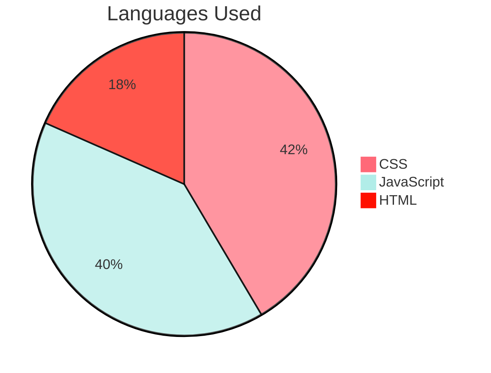

# React Job Listing Application

This application is a job listing page where user can filter the jobs based on labels. The main challenge was to create it by following in detail the design proposed by https://www.frontendmentor.io/.

## Deployed Website

Access the deployed version of the application: [cyf-lorenacapraru-jobs.netlify.app/](https://cyf-lorenacapraru-jobs.netlify.app/)

## Inside The App


## Features

- [x] The user can see all the jobs listed
- [x] The user has search functionality based on job role, job level, job languages.


## Technologies Used:

- [ ] React.js
- [ ] HTML
- [ ] CSS


## Pie Chart Of Languages Used



## Installation

**Clone the repository:**

```bash
git clone github.com/LorenaCapraru/tv-show-dom-project
```

**Install dependencies:**

```bash
npm install
```

**Start the development server:**

```bash
npm start
```
